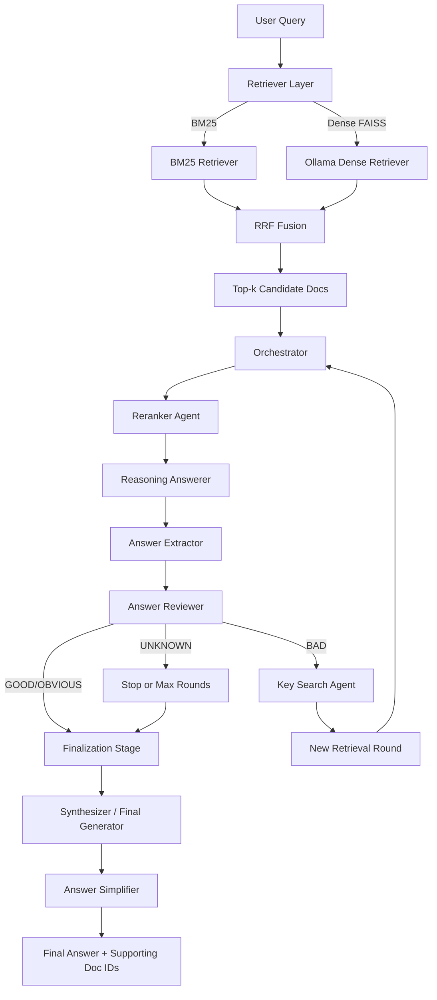

# Multi-Agent Retrieval-Augmented Generation (RAG)

A production-style, research-oriented question answering system that combines:
- hybrid retrieval (BM25 + dense embeddings),
- LLM-driven multi-agent reasoning loops,
- optional ColBERT reranking,
- reproducible evaluation scripts and datasets.

The repository includes corpus files, training/validation/test splits, prebuilt indexes, and end-to-end inference/evaluation code.

## Highlights

- Multiple retrieval backends: `Hybrid`, `BM25`, `Static (GloVe)`, and `ColBERT`.
- Agentic orchestration with iterative retrieval, review, reranking, and synthesis.
- Interactive Gradio UI for qualitative debugging and trace inspection.
- Parallel batch prediction pipeline for scalable evaluation.
- Local-first inference with Ollama, plus cloud LLM options via API keys.

## System Architecture



## Repository Layout

```text
.
├── Code/
│   ├── data/                # Corpus, splits, FAISS indexes, metadata
│   ├── src/                 # Retrieval, agents, UI, model service wrappers
│   ├── evaluation/          # Prediction build + official evaluation scripts
│   └── README.md            # Short runbook for the Code submodule
├── requirements.txt
├── environment.yml
└── Dockerfile
```

## Quick Start (Conda)

From repository root:

```bash
conda env create -f environment.yml
conda activate rag-agent-env
```

Or manually:

```bash
conda create -n rag-agent-env python=3.10 -y
conda activate rag-agent-env
pip install -r requirements.txt
```

## Model Setup

### Option A: Local LLM + Embeddings (Ollama)

Install Ollama, then pull the required models:

```bash
ollama pull mxbai-embed-large:335m
ollama pull bge-m3:latest
ollama pull qwen3-embedding:latest
ollama pull qwen2.5:7b-instruct
```

Optional environment variable (defaults to `http://127.0.0.1:11434`):

```bash
export OLLAMA_HOST=http://127.0.0.1:11434
```

### Option B: Remote LLM API (for batch evaluation script)

Create `Code/.env`:

```bash
OPENROUTER_API_KEY=your_key_here
```

## Run the UI

```bash
cd Code
python src/gui.py
```

Default local URL is printed by Gradio (typically `http://127.0.0.1:7860`).

## Reproduce Batch Predictions and Evaluation

```bash
cd Code
python evaluation/build_predictions_full_pipeline_parallel.py
python evaluation/reorder_and_normalize_predictions.py \
  --input_file predictions_full_pipeline.jsonl \
  --output_file predictions_full_pipeline_reordered.jsonl \
  --gold_file ./data/validation.jsonl
python evaluation/official_eval_hotpotqa.py --gold ./data/validation.jsonl --pred predictions_full_pipeline_reordered.jsonl
python evaluation/official_eval_retrieval.py --gold ./data/validation.jsonl --pred predictions_full_pipeline_reordered.jsonl
```

## Performance Snapshot

### Validation Set

Primary metrics:

| Metric | Score |
|---|---:|
| Exact Match (EM) | **0.6213** |
| Answer F1 | 0.7481 |
| nDCG@10 | **0.7941** |
| MAP@10 | 0.7219 |
| Recall@10 | 0.8757 |

Full QA metrics:

| Metric | Score |
|---|---:|
| em | 0.6213333333333333 |
| f1 | 0.7480557687009691 |
| prec | 0.7725845016581858 |
| recall | 0.7606643171643173 |
| sp_em | 0.0 |
| sp_f1 | 0.47356507936507564 |
| sp_prec | 0.33237777777776945 |
| sp_recall | 0.8273333333333334 |
| joint_em | 0.0 |
| joint_f1 | 0.36529231796666417 |
| joint_prec | 0.2633757583352279 |
| joint_recall | 0.6443694758944757 |

Full retrieval metrics:

| Metric | Score |
|---|---:|
| map_at_2 | 0.6193333333333333 |
| map_at_5 | 0.7095055555555555 |
| map_at_10 | 0.72188082010582 |
| ndcg_at_2 | 0.6757048700149353 |
| ndcg_at_5 | 0.7745762389600916 |
| ndcg_at_10 | 0.7940925396875408 |
| recall_at_2 | 0.653 |
| recall_at_5 | 0.8273333333333334 |
| recall_at_10 | 0.8756666666666667 |
| precision_at_2 | 0.653 |
| precision_at_5 | 0.3309333333333333 |
| precision_at_10 | 0.17513333333333334 |

### Hidden-Label Test Set

Ground truth labels were not released; official leaderboard scores:

| Metric | Score |
|---|---:|
| Retrieval Score | **0.757011** |
| QA Score | **0.635932** |

## Docker

Build from repository root:

```bash
docker build -t multi-agent-rag .
```

Run containerized UI (macOS/Windows host Ollama):

```bash
docker run --rm -p 7860:7860 \
  -e OLLAMA_HOST=http://host.docker.internal:11434 \
  multi-agent-rag
```

For full retrieval testing with local FAISS artifacts, mount your data directory:

```bash
docker run --rm -p 7860:7860 \
  -e OLLAMA_HOST=http://host.docker.internal:11434 \
  -v "$(pwd)/Code/data:/app/Code/data" \
  multi-agent-rag
```

For Linux, use either `--add-host=host.docker.internal:host-gateway` or point `OLLAMA_HOST` to a reachable Ollama endpoint.

## Data and Artifacts

- The repository includes corpus and split files (`train.jsonl`, `validation.jsonl`, `test.jsonl`) and retrieval artifacts.
- Index files in `Code/data/` are expected by default for fast startup.
- If required, indexes can be rebuilt using scripts in `Code/src/`:
  - `build_index.py`
  - `build_index_bge_m3.py`
  - `build_index_colbert.py`
  - `build_index_qwen3-emb.py`
- Large FAISS binaries are tracked with Git LFS (`Code/data/*.bin`) for practical repository size and reproducible sharing.
- `Code/data/faiss_index_qwen3-emb.bin` is intentionally excluded from GitHub (over 2GB LFS limit) and should be distributed via external storage if needed.

## Publish Checklist (GitHub + LFS)

```bash
git lfs install
git add .gitattributes .gitignore README.md Dockerfile requirements.txt environment.yml Code
git commit -m "Prepare professional public release with Docker and LFS artifacts"
```

If your remote is already configured:

```bash
git push origin main
git lfs push origin --all
```

## Notes

- Default retrieval fusion uses reciprocal rank fusion-style scoring over sparse+dense outputs.
- The agentic loop is configurable via UI toggles and script parameters (`max_rounds`, `top_k`, worker count).
- For reproducibility, keep dependency versions pinned via `requirements.txt`.
